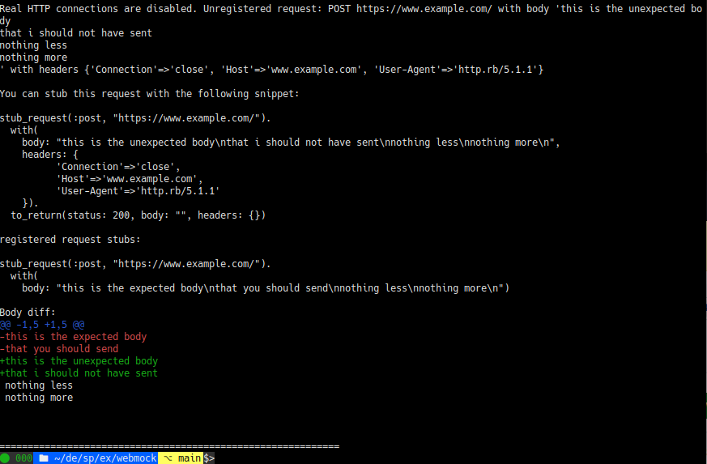
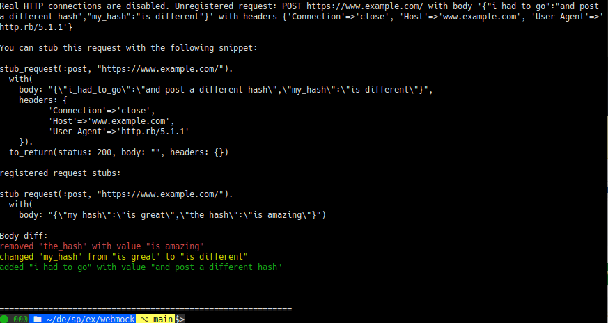

# Specdiff

A gem for improving diff output in webmock.

Webmock currently has a somewhat hidden feature where it will produce a diff
between a request body and a registered stub when making an unregistered request
if they happen to both be json (including setting content type). This gem aims
to bring text diffing (ala rspec) to webmock via monkey-patch, as well as
dropping the content type requirement.

Specdiff automagically detects the types of provided data and prints a suitable
diff between them.

Check out the examples directory to see what it might look like.

## Cool, what does it look like?

When specdiff is enabled, webmock will produce a generic text diff using
[`Diff::LCS`](https://github.com/halostatue/diff-lcs) (basically the same
diff as rspec uses):



It will also produce a json [hashdiff](https://github.com/liufengyun/hashdiff),
even if the request did not have the content type header:



(The output of the json diff is experimental, feedback would be great!)

## Installation

Add this line to your application's Gemfile:

```ruby
gem "specdiff", require: false
```

And then execute:

    $ bundle install

Or install it yourself as:

    $ gem install specdiff

## Usage

Put the following in your `spec_helper.rb`. (Or equivalent initializer
for test environment) You probably don't want to load/use this gem in a release
environment.

```rb
# spec_helper.rb

require "specdiff"
require "specdiff/webmock" # optional, webmock patches

# optionally, you can turn off terminal colors
Specdiff.configure do |config|
  config.colorize = true
end
```

### WebMock

The webmock patch should make webmock show request body diffs by using the
specdiff gem when stubs mismatch. It only applies to request bodies.

### Direct usage

You can also use the gem directly:

```rb
diff = Specdiff.diff(something, and_something_else)

diff.empty? # => true/false, if it is empty you might want to not print the diff, it is probably useless
diff.to_s # => a string for showing to a developer who may or may not be scratching their head
```

### Registering plugins

```rb
# Specdiff comes with json support, but it must be loaded like so:
Specdiff.load!(:json)

# Custom plugins can be loaded like this:
Specdiff.load!(MyCustomType)
```

[Check out the source code](./lib/specdiff/plugins/json.rb) to learn the plugin interface.

## Development

Check out the [glossary](./glossary.txt) to make sure you (and I) are using the
same words for things ;)

Install the software versions specified in `.tool-versions`.

Run `bin/setup` to install dependencies. Then, run `bundle exec rake` to run the tests and linter and make sure they're green before starting to make your changes.

Run `bundle exec rake -AD` for a full list of all the available tasks you may use for development purposes.

You can also run `bin/console` for an interactive prompt that will allow you to experiment with the gem code loaded.

Remember to update the unreleased section of the [changelog](./CHANGELOG.md) before you submit your pull request.

## How it works/"Architecture"

High level description of the heuristic specdiff implements

  1. receive 2 pieces of data: `a` and `b`
  2. determine types for `a` and `b`
      1. test against plugin types
      2. test against built in types
      3. fall back to the `:unknown` type
  3. determine which differ is appropriate for the types
      1. test against plugin differs
      2. test against built in differs
      3. fall back to the null differ (`NotFound`)
  7. run the selected differ with a and b
  8. package it into a `::Specdiff::Diff` which records the detected types

  \<time passes>

  6. at some point later when `#to_s` is invoked, stringify the diff using the differ's `#stringify`

## Releasing

### Release procedure

  - [ ] unit tests are passing (`$ bundle exec rake test`)
  - [ ] linter is happy (`$ bundle exec rake lint`)
  - [ ] `$ cd examples/webmock && bundle install && bundle exec ruby json.rb` looks good
  - [ ] `$ bundle exec ruby text.rb` looks good
  - [ ] update the version number in `version.rb`
  - [ ] make sure the `examples/` `Gemfile.lock` files are updated
  - [ ] move unreleased changes to the next version in the [changelog](./CHANGELOG.md)
  - [ ] commit in the form "vX.X.X" and push
  - [ ] make sure the pipeline is green
  - [ ] `$ bundle exec rake release`

To release a new version, update the version number in `version.rb`, and then run `bundle exec rake release`, which will create a git tag for the version, push git commits and the created tag, and push the `.gem` file to [rubygems.org](https://rubygems.org).

## Contributing

Bug reports and pull requests are welcome on GitHub at https://github.com/odinhb/specdiff.

## License

The gem is available as open source under the terms of the [MIT License](https://opensource.org/licenses/MIT).

## TODO

This documents potential improvements/issues I know about or have thought about.

- [ ] test the webmock monkey-patch. currently there is an empty webmock_spec.rb (should we do this using rspec?) and the examples/ directory contains a few webmock examples (which are a good idea to run before releasing) but it would be nice to have the pipeline fail if it doesn't work for whatever reason
- [ ] finalize plugin interface (are the methods named intuitively? should we split type detector definitions and differ definitions?)
- [ ] document how to define a plugin properly (instead of just linking to the source code)
- [ ] is the stringification of hashdiff's output really better than pretty print? or just more wordy? (the colors are definitely nice)
