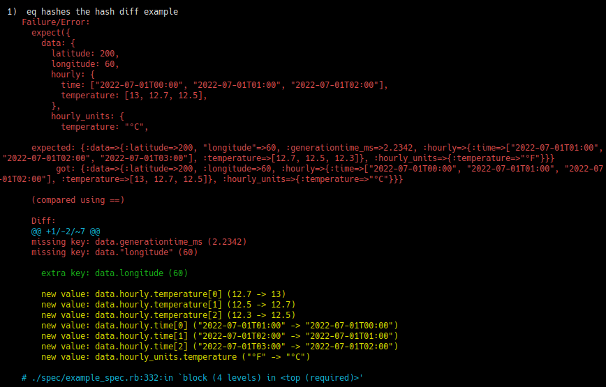

# Specdiff

Specdiff is an opinionated gem that provides diffing between arbitrary data. It
was built in an effort to improve [WebMock](https://rubygems.org/gems/webmock)'s
and [RSpec](https://rubygems.org/gems/rspec)'s diff output, and
comes with integrations for both. It produces output that looks very similiar to
RSpec, but with better support for nested hash/array structures.

By default, specdiff will produce diff output for multiline text by using
[diff-lcs](https://rubygems.org/gems/diff-lcs):


It also diffs hashes and arrays:

|  |  |
| --- | --- |
| Hashdiff based hash diff | Text based hash diff |

Specdiff will automatically switch between these two types of hash/array diff
output depending on what it thinks is more readable. The first type of output
showcased here comes from the
[hashdiff](https://rubygems.org/gems/hashdiff) gem, one of specdiff's
dependencies. The other is the *text diff* run on the output of *hashprint*.
Specdiff switches to using hashprint/text diff when it estimates that a lot of
the keys changed names, which is a point of weakness for hashdiff's output.

## Installation

### Requirements

Specdiff is tested to work with:
- Ruby `>= 3.0`.
- RSpec `3.13.0`, `3.12.2`, `3.12.0`.
- WebMock `3.19.1`, `3.18.1`.

### Use bundler

Add this line to your application's Gemfile:

```ruby
gem "specdiff", require: false
```

And then execute:

`$ bundle install`

### Loading the gem and its integrations

Put the following in the initializer for your test environment (`spec_helper.rb`):

```rb
require "specdiff" # may be unneccessary if you're using bundler to load your gems
require "specdiff/rspec" # optional, enables RSpec integration
require "specdiff/webmock" # optional, enables WebMock integration
Specdiff.load!(:json) # optional, automatically detects json and uses the hash differ on it

Specdiff.configure do |config|
  config.colorize = true # toggles color output
end
```

The monkey-patches should go after the gems they are patching.

*This gem is intended for use in test environments, not production or release environments.*

## Usage

Specdiff has two integrations: [WebMock](https://rubygems.org/gems/webmock) and
[RSpec](https://rubygems.org/gems/rspec). These are the main way specdiff is
intended to be used.

### RSpec

The RSpec integration improves on RSpec's built in diffing functionality by
diffing nested hash/array structures with
[hashdiff](https://rubygems.org/gems/hashdiff). This produces clearer
output when deeply nested structures are involved:

|  |  |  |
| --- | --- | --- |
| Test source | RSpec's diff | Specdiff's diff |

In some cases specdiff may produce a text-based diff of deeply nested hashes or
arrays instead. This also represents an improvement over RSpec's text-based diff
of nested hashes/arrays, by virtue of custom pretty-printing code designed for
the text differ to work on:

|  |  |  |
| --- | --- | --- |
| Test source | RSpec's diff | Specdiff's diff |

The RSpec integration also prevents RSpec from truncating your data before
printing it (by replacing the inspect implementation), avoiding the necessity
of a diff in some instances:

|  |  |
| --- | --- |
| RSpec truncating your data | Specdiff preventing truncation |

(Although this is an instance where a "word diff" would be more helpful)

### WebMock

WebMock already ships with a dependency on
[hashdiff](https://rubygems.org/gems/hashdiff), providing diffs of json request
stubs. Specdiff prints hashdiff's output differently, and does not require the
content type to be specified:

(This requires you to enable the json plugin)

|  |  |  |
| --- | --- | --- |
| Source | WebMock | Specdiff |

With specdiff enabled you also get text diffs where previously there were none:

|  |  |  |
| --- | --- | --- |
| Source | WebMock | Specdiff |

The WebMock integration continues to respect the `show_body_diff` setting in
WebMock:

```rb
# this will cause diffs to not be produced, regardless of whether specdiff is
# loaded. body diffs are enabled by default in WebMock so you don't need to
# touch this.
WebMock.hide_body_diff!
```

### Direct usage

It is also possible to call into specdiff with arbitrary data.
This is essentially what the integrations do for you.
This is suitable if you are developing a library and intend to depend on
specdiff for diff output.

```rb
# Generate a diff, using all plugins available.
diff = Specdiff.diff(something, anything)

diff.empty? # => true/false, if true you probably don't want to actually show the diff
diff.to_s # => a String for showing to a developer who may or may not be scratching their head

# Generate an indented, pretty-printed string representation of a ruby hash.
printed_hash = Specdiff.hashprint(my_big_nested_hash)
printed_hash # => String

# Inspect something, but with prettier output for certain classes
# (Time/DateTime/BigDecimal). This is not indented. Usually defers to #inspect.
specdiff_inspected = Specdiff.diff_inspect(something)
specdiff_inspected # => String
```

Any methods or properties not documented here are considered private
implementation details.

## Plugins

It is possible to create and load plugins into specdiff to customize Specdiff's
behaviour. This was implemented in case you have special needs (e.g. diffing
things other than text, hashes, arrays and json).

### JSON

The built-in json plugin is optional, and loaded like so:

```rb
Specdiff.load!(:json)
```

The JSON plugin attempts to parse strings into json using `JSON.parse`. If
successful, it considers that string a json, and will use the parse result as if
it had been passed directly to specdiff in the first place.

### Defining your own plugins

While other plugins are loaded by simply passing them to `::load!`:

```rb
class MySpecdiffPlugin
  # Read the source code to figure out how plugins work. Sorry.
end

Specdiff.load!(MySpecdiffPlugin)
```

This was intended to allow implementing (potentially janky and inefficient)
plugins to help diff XML, but in practice the text differ was good enough for
diffing indented XML.

## Contributing

Read [DEVELOPMENT.md](./DEVELOPMENT.md) for current development practices.

Bug reports and pull requests are welcome on GitHub at https://github.com/odinhb/specdiff.

## License

The gem is available as open source under the terms of the [MIT License](https://opensource.org/licenses/MIT).
